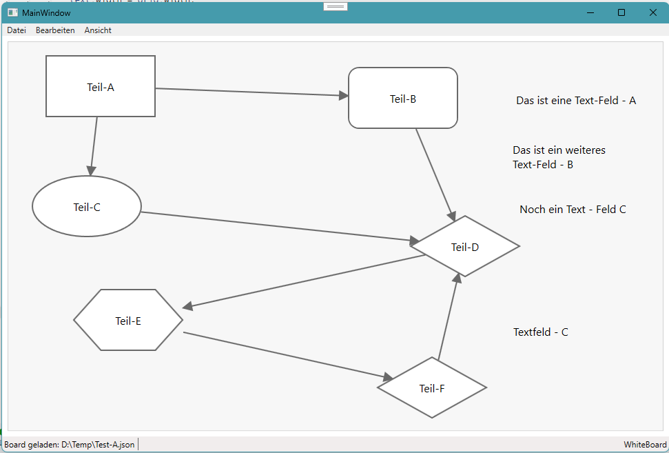

# Whiteboard WPF

# Projekt
Dieses Demo dient dazu, ein klassisches Whiteboard in WPF/C# zu erstellen. Es sind einfache Grundfunktion wie Rechteck, Texte, Verbindungespfeile geplant.

## Funktionen
Das Board ist mit einfachen grundlegen Funktionen ausgestattet.
- Laden und Speichern der Board Elemente
- Shapes
  - Rechteck
  - Rechteck mit abgerundeten Ecken
  - Ellipse
  - Raute
  - Sechseck
- Text
  - Beschreibende Texte (können nicht mit Pfeilen verbunden werden)
- Pfeile
  - Automatisches Verbinden durch eine Pfeilart

- Erste Erstellung, Version vom 08.08 2026
